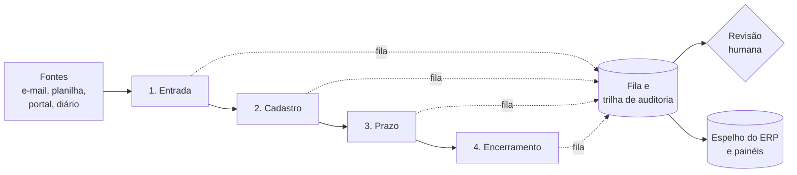

# Arquitetura de referência

Como eu organizo a automação de uma controladoria jurídica, do caso que chega ao caso que encerra.
É um desenho genérico: cada escritório tem o seu ERP, as suas fontes e as suas regras, e a
implantação se adapta a eles. O que não muda são as quatro etapas e as camadas que atravessam todas.

## As quatro etapas

### 1. Entrada: saber o que chegou

O caso novo aparece de muitos jeitos: e-mail do cliente, planilha de carteira, portal, publicação
que cita um processo que ainda não existe no ERP.

- **Captura:** cada fonte tem um leitor próprio que devolve sempre o mesmo formato (número do
  processo normalizado, cliente, origem, data de recebimento, documento original anexado).
- **Normalização:** o número do processo é validado pelo dígito verificador antes de qualquer
  consulta. Número inválido não segue: vira pendência para uma pessoa.
- **Deduplicação por entidade:** a pergunta não é "este número existe?", e sim "este número já
  existe **para este cliente**?". O mesmo processo pode estar legitimamente em dois clientes.
- **Classificação da entrada:** caso novo, incidente de caso existente, cumprimento de sentença com
  número novo, recurso. Errar aqui cria processo duplicado; na dúvida, a entrada vai para revisão.

### 2. Cadastro: gravar certo no ERP

- **Enriquecimento:** dados da capa (tribunal, classe, assunto, partes, valor) vêm de um provedor
  de dados processuais. Cada consulta tem custo e é registrada com cliente, área e responsável.
- **Simulação antes da escrita:** o lote inteiro roda primeiro sem gravar e produz o relatório do
  que seria criado. Quem aprova o relatório é a coordenação, com um clique, antes do cadastro.
- **Escrita idempotente:** cada item tem uma chave de controle. Rodar de novo não duplica; um item
  que falhou no meio é retomado do ponto em que parou.
- **Leitura de volta:** depois de gravar, a esteira lê o registro no ERP e confere campo a campo.
  API que responde sucesso e descarta o campo em silêncio existe, e é mais comum do que parece.
- **Pacote completo:** processo nunca nasce sozinho. Nasce com responsável, tarefa inicial e
  documentos vinculados, ou não nasce.

### 3. Prazo: nenhuma publicação sem dono

- **Captura e deduplicação** das publicações e intimações de todas as fontes.
- **Classificação** por tipo de ato e urgência, com regras explícitas para o que é óbvio e modelo de
  IA para o resto, sempre com avaliador independente (ver o caso 03).
- **Cálculo do prazo** em dias úteis, com calendário forense e feriados locais.
- **Tarefa com responsável** criada no ERP, com a publicação vinculada.
- **Retenção:** publicação antiga, ambígua ou de processo que não está na carteira não vira tarefa
  automática. Vai para a fila de revisão humana, com o motivo escrito.

### 4. Encerramento: fechar com critério

- **Régua objetiva:** trânsito em julgado, arquivamento, acordo cumprido, sem movimentação há N
  meses. Cada critério é uma consulta que devolve a lista de candidatos.
- **Revisão humana obrigatória:** a baixa nunca é automática. A lista vai para o responsável com a
  evidência de cada caso, e ele confirma um a um.
- **Vigilância pós-encerramento:** processo encerrado ainda recebe publicação. Ela é capturada e,
  se exigir ação, reabre a conversa com o responsável.

## As camadas que atravessam tudo

| Camada | O que resolve |
|---|---|
| **Fila e trilha de auditoria** | Cada item tem estado, tentativas e histórico. "Movido para a fila" não é "feito": feito é o que foi conferido no destino. |
| **Revisão humana** | Cartão com botão de decisão (aprovar, recusar, corrigir). A automação espera o clique; o prazo de resposta e o escalonamento são parte do desenho. |
| **Consumo de API** | Token renovado no meio da execução, respeito ao limite de requisições, paginação com teto e medição do consumo diário contra a cota do ERP. |
| **Custo** | Toda chamada paga (dados processuais, IA, OCR) vira linha com custo unitário, cliente e área. O custo real é custo unitário vezes volume, e o volume é medido antes de ligar. |
| **Espelho e painéis** | Cópia do ERP num banco relacional, modelo dimensional e painéis de carteira, prazo e produtividade. Relatório não consulta o ERP de produção. |
| **Barreiras no código** | Regra que protege cliente (por exemplo, "esta carteira não recebe cadastro automático") fica escrita no código e falha fechado. Configuração externa só acrescenta restrição, nunca remove. |

## Princípios de desenho

1. **O ERP é a fonte da verdade.** Planilha, espelho e painel divergiram? O ERP manda.
2. **Falhar fechado.** Faltou a lista, a credencial ou o dado de controle: a automação para e avisa.
   Trava que some em silêncio é pior do que trava nenhuma.
3. **Escrita em produção em janela controlada**, fora do horário de pico, com rollback escrito antes.
4. **Ação irreversível nunca é autônoma.** Baixa, exclusão e envio ao cliente passam por uma pessoa.
5. **Provar de dentro.** "Está funcionando" se demonstra com a execução, a contagem e o registro no
   destino, não com o log de quem executou.

Veja também: [método de trabalho](metodo.md) e os casos em [docs/casos](casos/).
