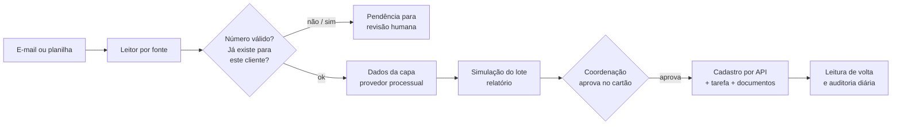

# Caso 01: esteira de cadastro de casos novos

> Escritório de contencioso de volume. Cliente, carteira e pessoas não são identificados.
> Números em ordem de grandeza.

## O problema

Casos novos chegavam por e-mail e por planilha de carteira, em lotes que iam de um punhado a
**milhares de processos**. Cada um era redigitado no ERP jurídico, campo por campo: capa do
processo, partes, cliente, responsável, tarefa inicial e documentos. Lote grande significava dias de
digitação, e erro de digitação significava processo duplicado ou prazo perdido.

## O que foi construído

1. **Leitor por fonte** devolve sempre o mesmo formato, com o documento original anexado.
2. **Validação e deduplicação:** dígito verificador do número do processo e busca no ERP **por
   cliente**. Cumprimento de sentença com número novo, recebido junto com o processo de origem, é
   tratado como incidente do caso existente, não como caso novo.
3. **Enriquecimento** com os dados da capa, com cada consulta registrada (custo, cliente, área).
4. **Simulação do lote inteiro**, sem gravar: o relatório diz o que será criado e o que ficou retido.
5. **Aprovação da coordenação** num cartão com botão. Sem clique, nada é gravado.
6. **Cadastro idempotente** por API: processo, responsável, tarefa inicial e documentos vinculados
   no mesmo passo. Item que falha é retomado de onde parou.
7. **Leitura de volta** de cada registro e **auditoria diária** comparando o que entrou com o que
   foi cadastrado.

## Decisões e o porquê

| Decisão | Porquê |
|---|---|
| Duplicidade verificada por cliente, não só pelo número | O mesmo processo pode existir legitimamente em dois clientes; bloquear pelo número sozinho barrava caso real. |
| Processo só nasce com tarefa | Pasta sem tarefa é pasta que ninguém olha. Pacote incompleto não é gravado. |
| Barreira de carteira escrita no código | Carteira que não pode receber cadastro automático é regra de cliente. Se dependesse de configuração, uma variável vazia desligaria a trava em silêncio. |
| Simulação offline antes de qualquer consulta paga em lote grande | Ampliar o escopo por engano multiplica o custo das consultas. O relatório da simulação mostra o tamanho do lote antes de gastar. |

## Armadilhas encontradas

- **Token que vence no meio da execução.** Um lote de dezenas de minutos com token de validade menor
  deixou casos cadastrados pela metade (sem documentos e sem campos complementares). Correção:
  renovar o token durante a execução e só marcar "feito" depois da leitura de volta.
- **API que responde erro e grava.** Resposta de falha não significa ausência de efeito. Antes de
  repetir um item, a esteira consulta o destino.
- **Atualização que responde sucesso e descarta campo.** Alguns campos são ignorados sem aviso na
  atualização. Só a leitura de volta mostra.
- **Registro existe, arquivo não.** O documento vinculado aparecia no cadastro e não abria. A
  conferência passou a baixar o arquivo, não só a checar o registro.

## Resultado, em ordem de grandeza

- Lotes de **milhares de processos** cadastrados em horas, não em dias.
- Duplicidade tratada na entrada, com a pendência explicada para quem decide.
- **Zero caso gravado sem aprovação** da coordenação, por construção.
- Custo de consulta por lote conhecido antes da execução.

## O que eu faria diferente

Começaria pela auditoria diária, antes da esteira. Ela mostrou problemas antigos da carteira que a
esteira teria herdado em silêncio.
