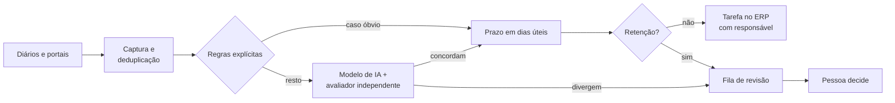

# Caso 02: classificação de publicações e prazos

> Controladoria jurídica com várias equipes e fontes de publicação. Cliente, carteira e pessoas
> não são identificados. Números em ordem de grandeza.

## O problema

Publicações e intimações chegavam de diários oficiais e portais, na casa de **dezenas de milhares
por mês**. Cada uma precisava de leitura, classificação (que ato é, que prazo abre, quem responde) e
de uma tarefa no ERP com prazo calculado. Feito à mão, o volume obrigava a triagem rápida, e triagem
rápida é onde o prazo se perde.

## O que foi construído

1. **Captura e deduplicação** entre fontes: a mesma publicação chega por mais de um caminho.
2. **Regras explícitas primeiro.** Boa parte do volume tem padrão textual inequívoco e não precisa
   de IA. Regra é barata, auditável e não muda de humor.
3. **Modelo de IA para o resto**, com um **avaliador independente** que confere a classificação
   (detalhes no [caso 03](03-ia-com-avaliador-independente.md)). Concordância segue; divergência vai
   para revisão.
4. **Prazo em dias úteis**, com calendário forense, feriados locais e regra de contagem por tipo de
   ato. Atenção ao fuso: prazo gravado às 23h59 com o fuso errado vira o dia seguinte.
5. **Retenção** do que não pode virar tarefa automática: publicação atrasada, processo fora da
   carteira ativa, ato ambíguo. Cada retenção leva o motivo escrito.
6. **Tarefa no ERP** com responsável pela equipe do assunto e a publicação vinculada.

## Decisões e o porquê

| Decisão | Porquê |
|---|---|
| Publicação atrasada nunca vira tarefa automática | Se já passou do tempo normal de tratamento, alguém precisa olhar o motivo antes. Tarefa automática com prazo vencido esconde o problema. |
| Regra antes de IA | Metade do caminho não precisa de modelo. Custa menos e explica melhor cada decisão. |
| Divergência entre modelo e avaliador vai para uma pessoa | O custo de revisar um item é pequeno perto do custo de um prazo errado. |
| Cartão sem prazo de resposta é proibido | Aprovação que ninguém responde prende a execução para sempre. Todo cartão tem tempo limite e escalonamento. |

## Armadilhas encontradas

- **Tarefa que nasce tarde.** Em alguns ERPs a tarefa aparece horas depois de a publicação ser
  salva, porque um fluxo interno atrasa. Conferir cedo demais dá falso "sem tarefa".
- **Publicação que cita o processo, mas não é dele.** Acórdão que menciona um processo da carteira
  como precedente não é intimação desse processo. Sem essa regra, a entrada cadastrava processo alheio.
- **Balde "outros" grande.** Quando a categoria genérica cresce, a classificação está errada, não a
  carteira. Virou indicador de qualidade no painel.

## Resultado, em ordem de grandeza

- **Dezenas de milhares de publicações por mês** classificadas, com a fração retida para revisão
  visível e explicada.
- Redução da rotina manual de triagem na casa de **centenas de horas por mês**.
- Prazo calculado pela mesma regra em todas as equipes.

## O que eu faria diferente

Mediria a concordância entre modelo e avaliador desde o primeiro dia, por tipo de ato. Foi esse
número que mostrou onde valia escrever mais uma regra em vez de gastar mais com modelo.
