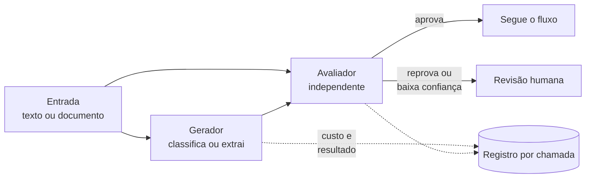

# Caso 03: IA com avaliador independente

> Padrão aplicado em classificação de publicações, extração de dados de documentos e minuta
> assistida. Sem identificar cliente, fornecedor ou modelo. Números em ordem de grandeza.

## O problema

Modelo de IA acerta a maior parte das vezes e erra com a mesma confiança com que acerta. Em rotina
jurídica, o erro raro é o que importa: um prazo classificado errado ou um campo extraído trocado.
Pedir para o mesmo modelo "conferir a própria resposta" não resolve, porque ele tende a concordar
consigo mesmo.

## O padrão

1. **Gerador:** o modelo que faz o trabalho (classificar, extrair, redigir), com saída estruturada
   e validada contra um esquema.
2. **Avaliador independente:** outra chamada, com outro prompt e, quando faz sentido, outro modelo.
   Recebe a entrada original e a resposta, e responde só "aprova" ou "reprova, porque...".
3. **Decisão por concordância:** aprovado segue; reprovado ou incerto vai para uma pessoa, com o
   motivo do avaliador.
4. **Registro por chamada:** modelo, tempo, tokens, custo, resultado e decisão final. É daí que saem
   o custo por documento e a taxa de acerto.
5. **Gabarito:** um conjunto de casos com resposta conhecida roda a cada mudança de prompt ou de
   modelo, antes de ir para produção.

## Decisões e o porquê

| Decisão | Porquê |
|---|---|
| Avaliador com raciocínio diferente do gerador | Conferidor que pensa igual erra igual. A independência vale mais que a sofisticação. |
| Saída estruturada validada por esquema | Texto livre esconde erro de formato. Esquema quebrado é reprovação automática, sem gastar avaliador. |
| Teto de custo por lote | Mudança de prompt pode multiplicar tokens. O lote para quando passa do teto e avisa. |
| Gabarito antes de trocar de modelo | Modelo novo que "parece melhor" pode piorar num tipo específico de caso. Só o gabarito mostra. |

## Armadilhas encontradas

- **Documento digitalizado sem texto.** Um PDF que é só imagem fazia o extrator devolver um valor
  vazio com cara de valor válido, e ele era gravado. Correção: detectar documento sem camada de
  texto, passar por OCR antes e reprovar saída vazia ou só com pontuação.
- **Modelo retirado do ar.** O provedor descontinuou um modelo e as chamadas passaram a falhar.
  Correção: modelo configurável, alternativa testada no gabarito e alerta na primeira falha.
- **Amostra pequena otimista.** Um teste com poucas dezenas de itens indicava acerto alto; com uma
  amostra maior, cobrindo as variações da carteira, apareceram erros concentrados num tipo de caso.
- **Teste que passa sem executar.** Uma bateria de verificação encerrava antes das últimas etapas e
  mesmo assim reportava "tudo certo". Toda bateria passou a conferir quantos casos de fato rodaram.

## Resultado, em ordem de grandeza

- **Custo por documento medido e rateado** por área, conhecido antes de ligar o lote.
- Fração enviada para revisão humana pequena e explicada, com o motivo do avaliador.
- Troca de modelo feita por decisão com número (gabarito), não por impressão.

## O que eu faria diferente

Montaria o gabarito antes do primeiro prompt. Ele é o que transforma "a IA está boa" numa frase
que dá para conferir.
